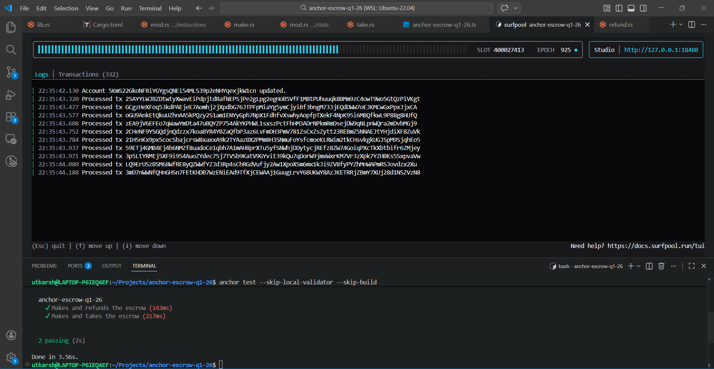

# Anchor Escrow

A token escrow program built on Solana using the Anchor framework. Enables trustless peer-to-peer token swaps between two parties via an on-chain escrow account.

## Overview

A maker creates an escrow by depositing Token A and specifying the desired amount of Token B. A taker can fulfill the escrow by depositing Token B, which releases Token A to the taker and Token B to the maker. The maker can also refund the escrow to reclaim their deposited tokens.

## Instructions

- **Make** -- Create an escrow, deposit Token A, and specify the desired Token B amount.
- **Take** -- Fulfill an existing escrow by depositing Token B and receiving Token A.
- **Refund** -- Cancel an escrow and reclaim deposited Token A.

## State

The `Escrow` account stores:

- `seeds` -- Unique seed for PDA derivation
- `maker` -- Public key of the escrow creator
- `mint_a` -- Mint address of the deposited token
- `mint_b` -- Mint address of the requested token
- `recieve` -- Amount of Token B expected
- `bump` -- PDA bump seed

## Tests Passing



## Build and Test

```
anchor build
anchor test
```

## Program ID

```
H5CNM8BPgH63ut9RK7aoJBohjk8YPtErvrpjzadpFH33
```